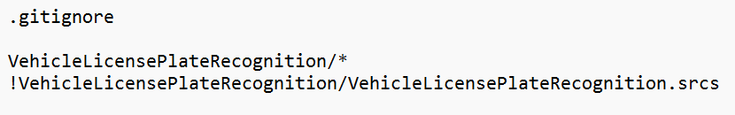

# Vehicle License Plate Recognition

### Introduction:

这个工程是基于FPGA的车牌识别系统的实现，并未使用一些IP，所有代码由Verilog编写，将很便利的移植到各种开发平台上，如Altera与Xilinx的各类型号fpga，考虑到二维数组等接口在顶层传递的便利性，一些文件的后缀改为.sv，其中主要的工程文件如下:

- ***pic***

- ***QuestaSim***

- ***VehicleLicensePlateRecognition***

其中**pic**文件夹存放着用来仿真及结果存储的车牌图像，**QuestaSim**文件夹中存放着Modelsim仿真的工程（仅仅是Modelsim的工程文件），**VehicleLicensePlateRecognition**文件夹中存放着整个工程的源码（车牌识别的源码）。

考虑到Vivado的工程太大，所以用了如下的***.gitignore***，仅仅上传了保存着有源码的src文件夹

可按照***<u>VehicleLicensePlateRecognition</u>***的名字创建一个工程，并将源码加入新创建的工程。

### Tips：

​	本工程中的仿真文件中读取bmp与保存bmp用的读取函数都是使用***相对路径***，如果不想自己重新切换下路径的话，上述三个文件夹及Vivado工程结果需与此教程一致。

​	本工程中modelsim与vivado可以使用***Modelsim Simulator***或者***Vivado Simulator***自带的仿真器进行仿真，切换仿真器时在testbench顶层需选择将***QuestaSim***宏注释与否

### Modelsim Simulation：

- 打开Modelsim软件

- 选择***QuestaSim***文件夹中的***.mpf***文件打开ModelSim工程

- 将***VehicleLicensePlateRecognition***中所有源码加入到***Project***窗口中

- 点击***Library***工作区，点开***work***工作目录，选择***bmp_sim_VIP_tb***文件，右键选择仿真不带优化

- 选择想观察的波形，在tcl窗口中输入“***run 43ms***”命令，运行后会在***pic***相应目录下出现仿真后的图片

