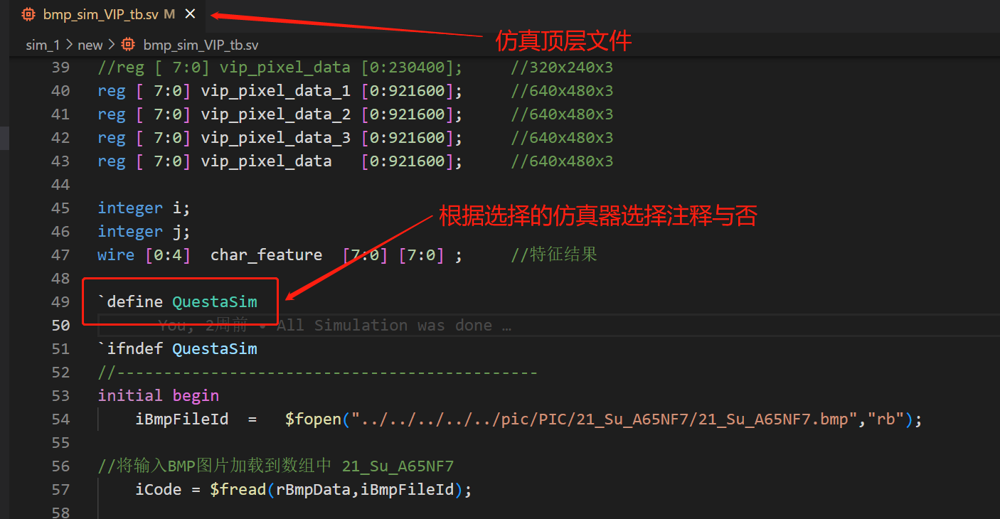
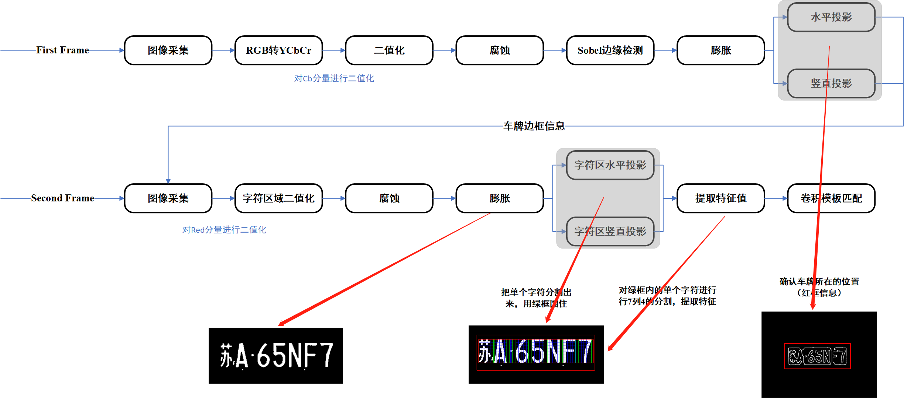
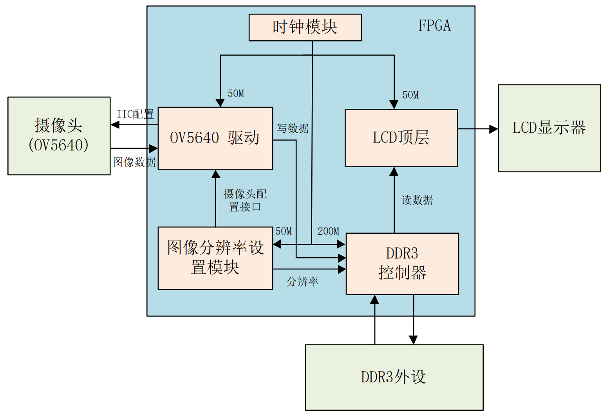
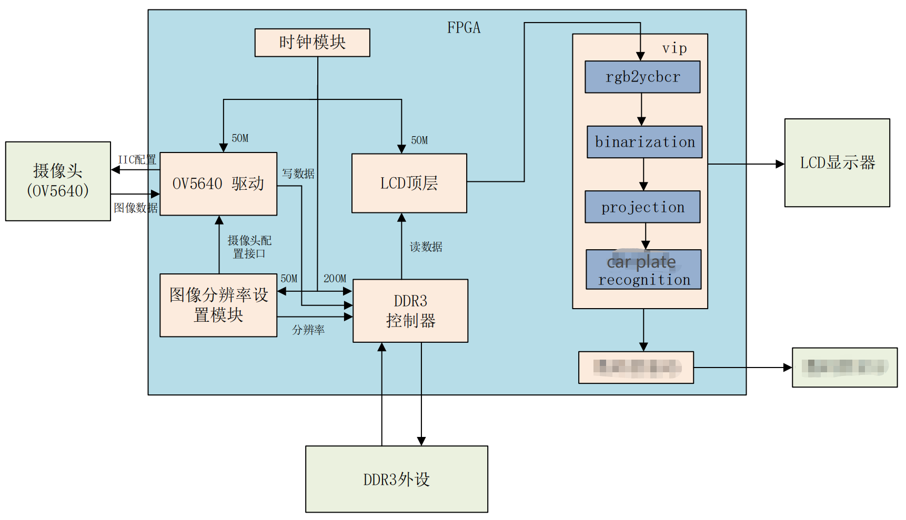
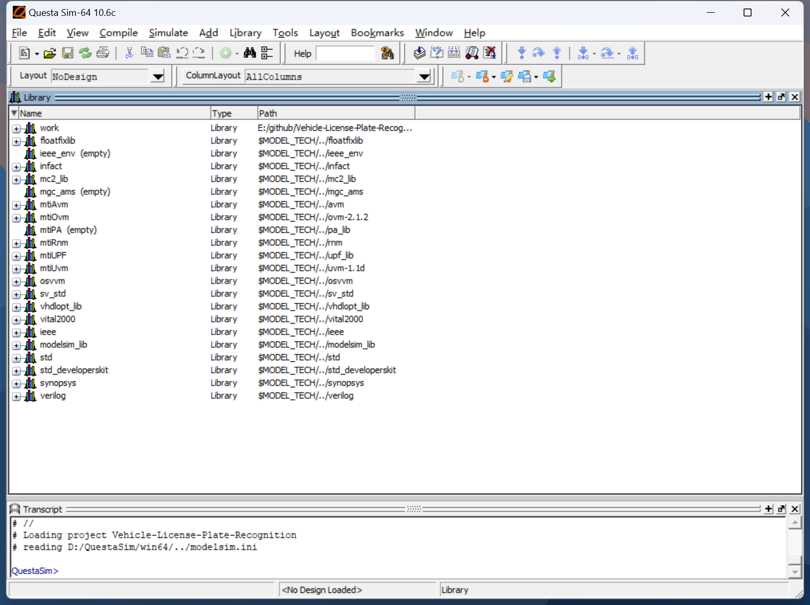
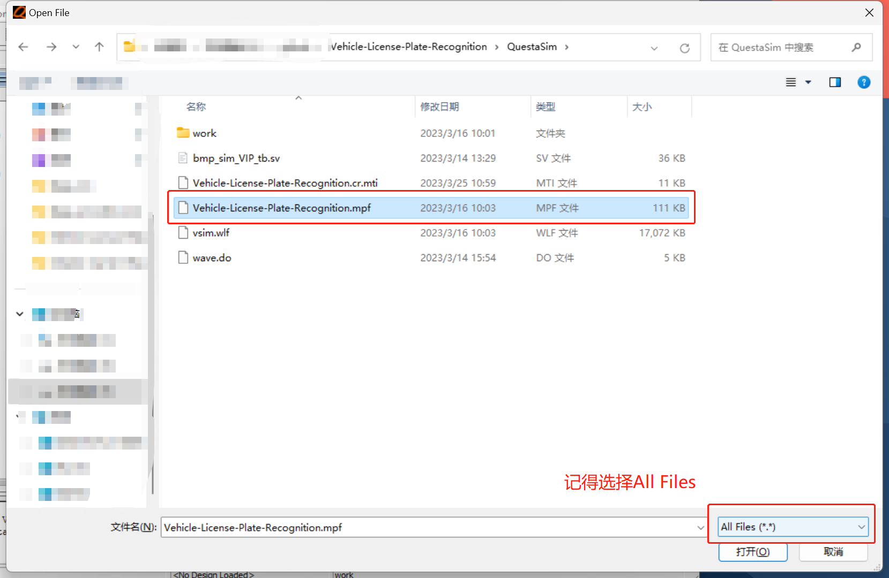
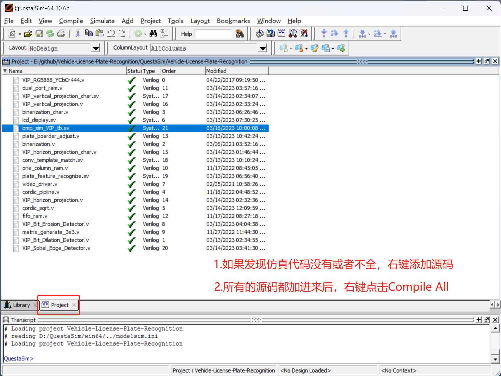
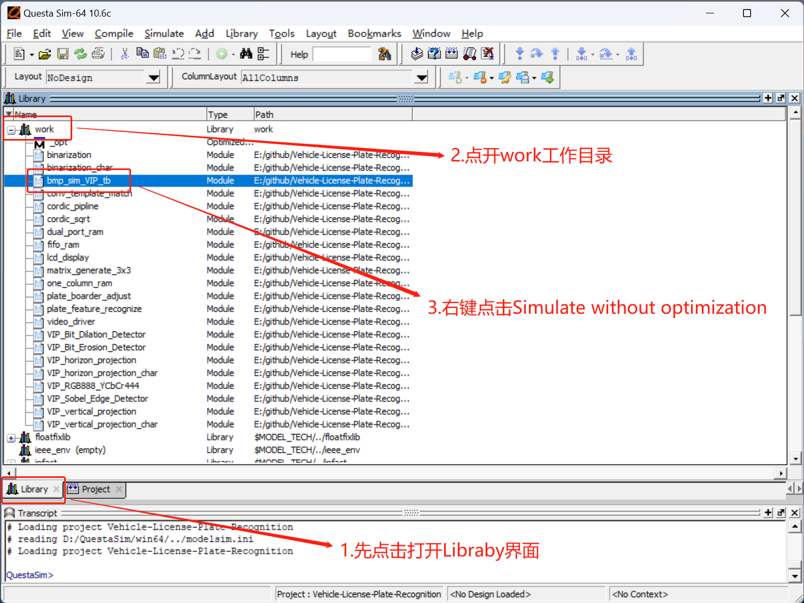
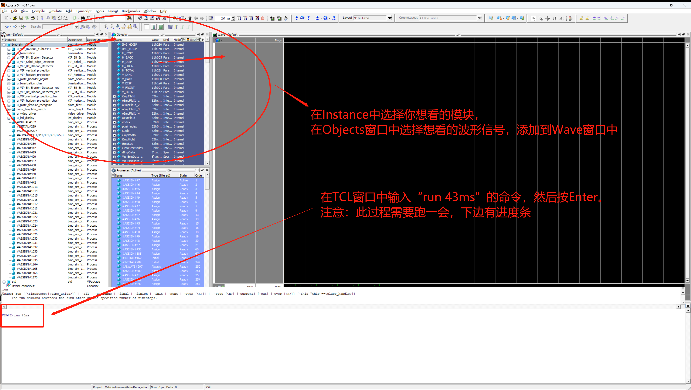

# Vehicle License Plate Recognition

### Introduction:

​	这个工程是基于FPGA的车牌识别系统的实现，并未使用一些IP，如开方用Cordic算法替代，卷积层利用FIFO实现，所有代码由Verilog编写，将很便利的移植到各种开发平台上，如Altera与Xilinx的各类型号fpga，考虑到二维数组等接口在顶层传递的便利性，一些文件的后缀改为.sv，其中主要的工程文件如下:

- ***pic***

- ***QuestaSim***

- ***VehicleLicensePlateRecognition***

​	其中**pic**文件夹存放着用来仿真及结果存储的车牌图像，**QuestaSim**文件夹中存放着Modelsim仿真的工程（仅仅是Modelsim的工程文件），**VehicleLicensePlateRecognition**文件夹中存放着整个工程的源码（车牌识别的源码）。

​	考虑到Vivado的工程太大，所以用了如下的**.gitignore**，仅仅上传了保存着有源码的src文件夹

```
.gitignore

VehicleLicensePlateRecognition/*
!VehicleLicensePlateRecognition/VehicleLicensePlateRecognition.srcs
```

​	可按照***VehicleLicensePlateRecognition***的名字创建一个工程，并将源码加入新创建的工程。


### Tips：

​	本工程中的仿真文件中读取bmp与保存bmp用的读取函数都是使用***相对路径***，如果不想自己重新切换下路径的话，上述三个文件夹及Vivado工程结果需与此教程一致。

​	本工程中modelsim与vivado可以使用***Modelsim Simulator***或者***Vivado Simulator***自带的仿真器进行仿真，切换仿真器时在testbench顶层需选择将***QuestaSim***宏注释与否。工程需仿真***43ms***才能出现结果，Vivado仿真太慢了，推荐使用Modelsim仿真。

​	若有车牌侵权行为，告知即删。




### Frame Work:

​	整体代码实现框图如图所示




### Usage:

​	由于摄像头输出速率与显示设备的驱动频率不一致，一般摄像头驱动显示的demo往往是配置好摄像头的驱动后，将摄像头数据通过异步FIFO乒乓写到DDR中，在通过异步FIFO乒乓读取出来数据，配合产生能够驱动显示设备的时序，其框图如下图所示：



​	一般对于FPGA的图像实时处理往往会在传入ddr前，或者在读取ddr后，对原图像进行一系列处理，而往往在FPGA的硬件实现的过程中，往往需要大量的结果仿真，而DDR的模拟往往会消耗大量的时间，且这些驱动显示模块也是比较固定的，不需要大量的改变，因此一般仿真设计一个图像处理算法往往仅需对图像处理算法进行仿真，如本次工程中的车牌识别，只需将仿真后的代码例化到LCD（任意显示设备）的顶层文件中，即下图中的VIP处理模块，即可实现基于FPGA的实时车牌识别系统。




### Modelsim Simulation：

- 打开Modelsim软件




- 选择***QuestaSim***文件夹中的***.mpf***文件打开ModelSim工程




- 将***VehicleLicensePlateRecognition***中所有源码加入到***Project***窗口中




- 点击***Library***工作区，点开***work***工作目录，选择***bmp_sim_VIP_tb***文件，右键选择仿真不带优化




- 选择想观察的波形，在tcl窗口中输入“***run 43ms***”命令，运行后会在***pic***相应目录下出现仿真后的图片



